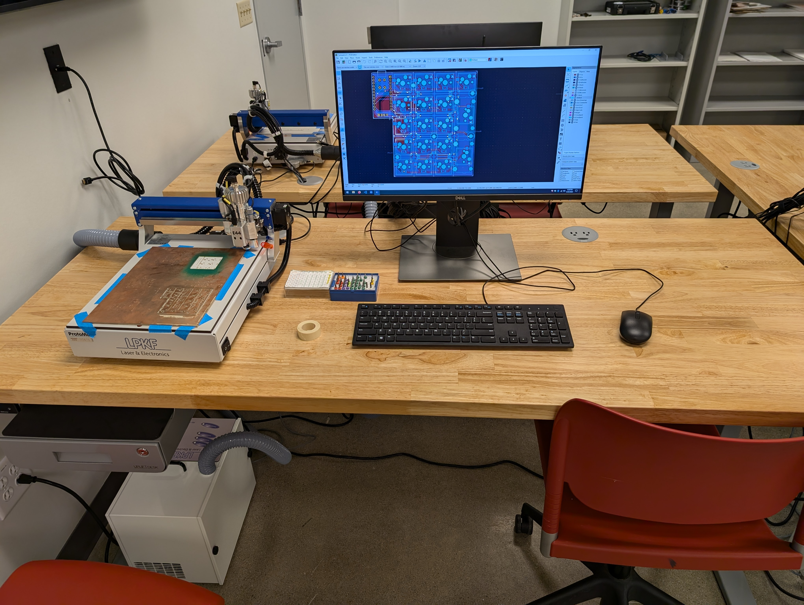
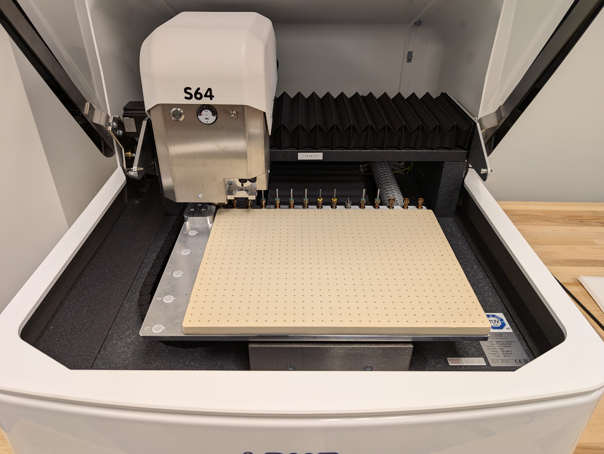

# Assured Digital Microelectronics Education & Training Ecosystem : ADMETE

The ADMETE lab (348 Russ Engineering) seeks to develop a pipeline of engineering students with skills in microelectronics design, testing, and hardware security.  In this lab we use industry standard prototyping equipment to manufacture and test printed circuit boards (PCBs).

This document serves to outline the equipment and processes available to students within the ADMETE space and in related labs.  

## ADMETE Equipment

Below is a list of all ADMETE equipment available in 348 Russ.

---

### ProtoMat E44 PCB Milling Machine

For performing Milling and drilling procedures on 1 and 2 sided circuit boards, the LPKF Protomat E44 can mill with +/- 0.02mm accuracy and +/- 0.005mm repeatability.  The E44 supports partial rubout (copper removal) and up to 8-layer boards with our additional heated press.  The primary purpose fo these machines is training in the basics of PCB prototyping and manufacturing limitations.

* [E44 manual](./docs/LPKF_E44_guide.pdf)
* [E44 user guide (WSU created)](./guides/e44.md)

---

### ProtoMat S64 PCB Milling Machine

Supports much of the same processes as the e44 but with automated tool changes, the LPKF Protomat S64 speeds up the prototyping process.  Used in conjunction with the ProtoLaser U4, the S64 is the ideal system for drilling through-holes, vias, fiducials (alignemtn holes), and for contour routing thhe board outline to remove it from the PCB material.

* [S64 manual](./docs/LPKF_S64_guide.pdf)
* [S64 user guide (WSU created)](./guides/s64.md)

---

# Guides
For the purposes of guides, I will be refrencing the [Yampad](https://github.com/mattdibi/yampad) which we have created many times before and we are confident in our production process of, as an example device. These guides will also assume a base level understanding of navigating Github, if you need help understanding [Github](https://docs.github.com/en/get-started/quickstart/hello-world), click here.

# ALL PROCEDURES AND PROTOCOLS ARE SUBJECT TO CHANGE
