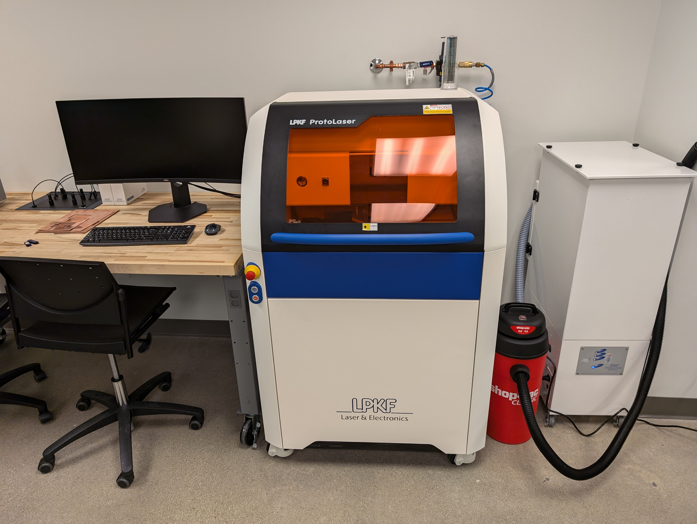
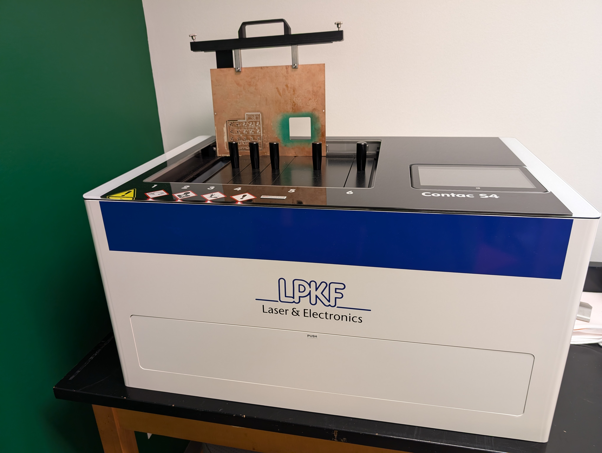
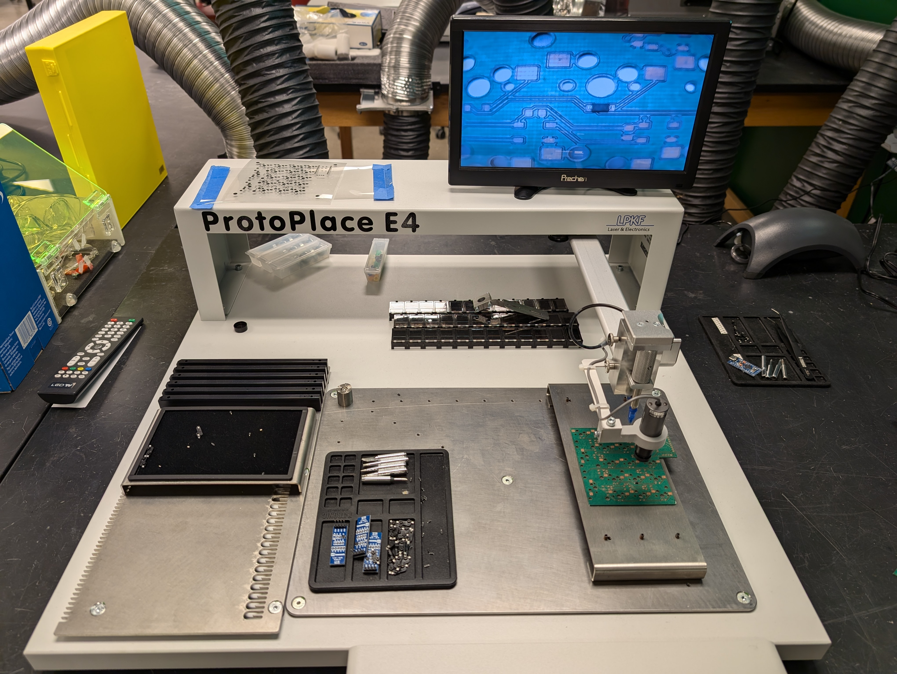
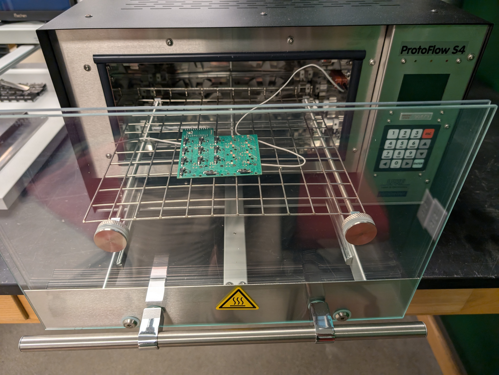
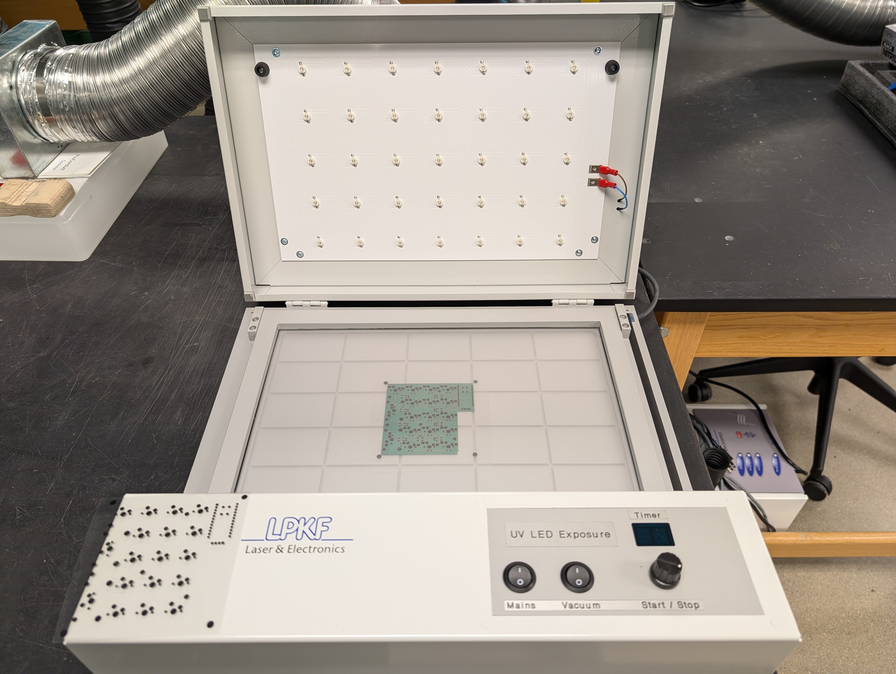
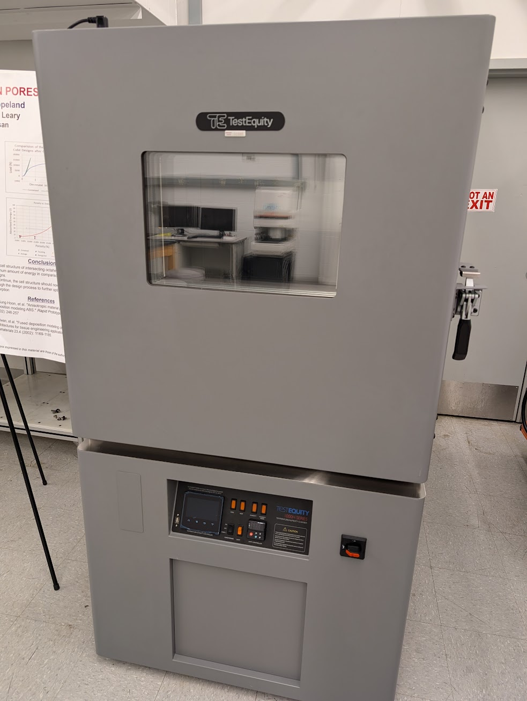

# Assured Digital Microelectronics Education & Training Ecosystem : ADMETE

The ADMETE lab (348 Russ Engineering) seeks to develop a pipeline of engineering students with skills in microelectronics design, testing, and hardware security.  In this lab we use industry standard prototyping equipment to manufacture and test printed circuit boards (PCBs).

This document serves to outline the equipment and processes available to students within the ADMETE space and in related labs.  

## ADMETE Equipment

Below is a list of all ADMETE equipment available in 348 Russ.

---

### ProtoMat E44 PCB Milling Machine

For performing Milling and drilling procedures on 1 and 2 sided circuit boards, the LPKF Protomat E44 can mill with +/- 0.02mm accuracy and +/- 0.005mm repeatability.  The E44 supports partial rubout (copper removal) and up to 8-layer boards with our additional heated press.  The primary purpose fo these machines is training in the basics of PCB prototyping and manufacturing limitations.

* [E44 manual](./docs/LPKF_E44_guide.pdf)
* [E44 user guide (WSU created)](./guides/e44.md)

---

### ProtoMat S64 PCB Milling Machine

Supports much of the same processes as the e44 but with automated tool changes, the LPKF Protomat S64 speeds up the prototyping process.  Used in conjunction with the ProtoLaser U4, the S64 is the ideal system for drilling through-holes, vias, fiducials (alignemtn holes), and for contour routing thhe board outline to remove it from the PCB material.

* [S64 manual](./docs/LPKF_S64_guide.pdf)
* [S64 user guide (WSU created)](./guides/s64.md)

---

### ProtoLaser U4

The ProtoLaser U4 is a 355nm UV laser based milling system allowing for much finer structures (50 micrometer line width, 15 micrometer separatation).  This system significantly speeds up the PCB prototyping process and allows for more precise and compact packaging of devices.

The LPKF laser system is one of the key pieces of this lab as it is an industry standard PCB prototyping system used in many aviation, space, and electronics companies

* [ProtoLaser U4 manual](./docs/)
* [ProtoLaser U4 user guide (WSU created)](./guides/)

---

### Contac S4 Through-hole Plater

The Contac S4 through hole plater uses a electroplating process to make electronic connections in between layers of the circuit board.  This allows for denser packaging of components while maintaining the required logical / electrical connections between devices.

* [Contac S4manual](./docs/)
* [Contac S4 user guide (WSU created)](./guides/contac_s4.md)

---

### ProtoPlace E4 Pick and Place Machine

The ProtoPlace E4 allows for quick and easy component placement of small sized surface-mount devices (SMD's), significantly speeding up prototyping compared to manual placement with tweezers.

* [ProtoPlace E4 manual](./docs/)
* [ProtoPlace E4 user guide (WSU created)](./guides/)

---

### ProtoFlow S4 Reflow Oven

The ProtoFlow S4 reflow oven allows students to use surface-mount devices and solder paste to attach chips and devices to their circuit board.  This reflow oven is software controlled to adhere to a strict thermal process for optimal lead-free solder application.

* [ProtoFlow S4 manual](./docs/)
* [ProtoFlow S4 user guide (WSU created)](./guides/)

---

### UV LED Solder Mask Curing Station

The UV curing station allows the application of a solder-resist mask of acrylic paint be added to a circuit board.  When used in conjunction with a solder mask printed on transparency material, the UV curing station allows selective curing of the acrylic solder-resist paint so that any necessary electricl connections can be later exposed for device placement.

* [UV curing manual](./docs/)
* [UV curing user guide (WSU created)](./guides/)

---

### Environmental Chamber (located in Electronic Materials Lab: 116 Russ Engineering)

The TestEquity Environmental Chamber is a device that allows us to test microelectronics in a variety of conditions by altering the ambient temperature and humidity of the chamber.  This allows for hot/cold/humid/dry testing of microelectronics with the potential to incite failures that may lead to security vulnerabilities. 

* [TestEquity Enviro Chamber manual](./docs/)
* [Enviro Chamber user guide (WSU created)](./guides/)

---

### Equipment Template

Paragraph

* [manual](./docs/)
* [user guide (WSU created)](./guides/)

---

### ALL PROCEDURES AND PROTOCOLS ARE SUBJECT TO CHANGE
